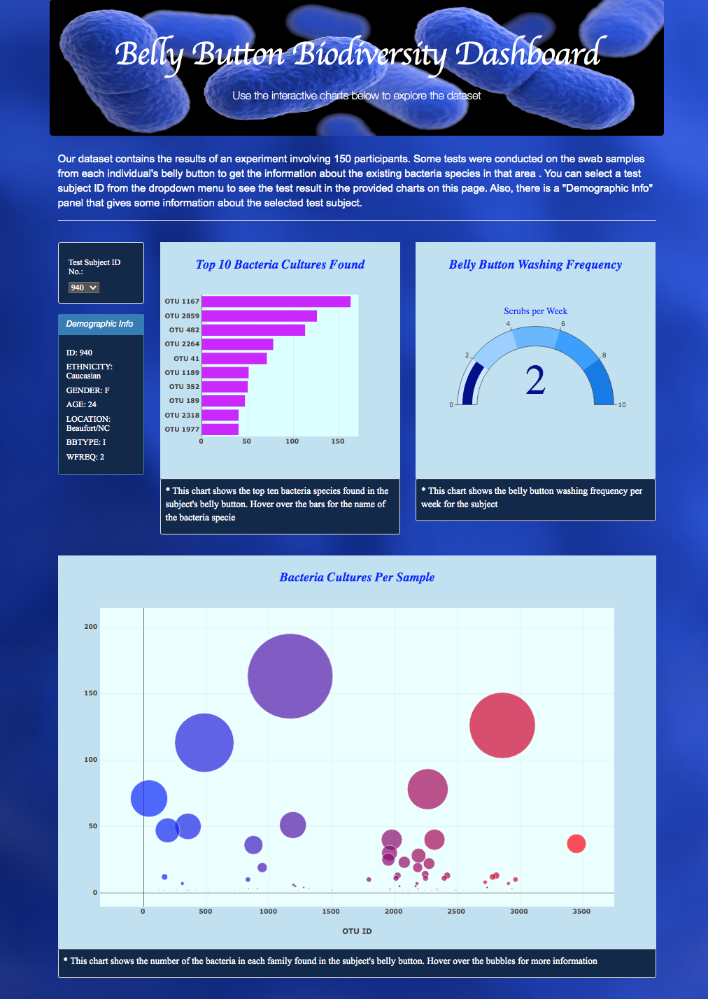

# **Belly-Button-Biodiversity**  

## **Overview of Project**
In this project we are creating an interactive dashboard to share the results of an experiment with users.

### **Project Summary**

An experiment was conducted on the swab samples from the belly button of 150 individuals to determine the bacteria species existing in the belly button of each test subject. Using HTML, JavaScript and Plotly, we designed a webpage to show the results of this experiment by creating an interactive dashboard that allows users to select the test subject id and explore the corresponding data.
This webpage can be accessed via "https://ehsan-o.github.io/Belly-Button-Biodiversity/"

&nbsp;

